# Forecasting Apple Stock Prices

## Problem Definition
**Target**

The goal of this project is to predict the intraday trend direction of Apple Inc. (AAPL) stock prices over the next t = [5, 10, 15, 30, 60] minutes using historical minute-level data from 2022-01-01 to 2025-06-30. 
We use a Random Forest model with features including the linear regression slope over each t-minute window, normalized by the mean price, to classify the trend direction.

**Input Features**

Normalized VWAP (volume weighted average price) and volume
Normalized exponential moving average (EMA) over t = [5, 10, 15, 30, 60] minutes
Linear regression slope of EMAs over t = [5, 10, 15, 30, 60] minutes
Second-order slope (acceleration) of EMAs over t = [5, 10, 15, 30, 60] minutes

---

## Table of Contents

- [1 - Data Acquisition](#1---data-acquisition)
- [2 - Data Understanding](#2---data-understanding)
- [3 - Pre-Split Preparation](#3---pre-split-preparation)
- [4 - Split Data](#4---split-data)
- [5 - Post-Split Preparation](#5---post-split-preparation)
- [6 - Feature Selection](#6---feature-selection)
- [7 - Model Training & Validation](#7---model-training--validation)
- [8 - Final Testing](#8---final-testing)
- [9 - Deployment](#9---deployment)

---

## 1 - Data Acquisition

### **Description**

Retrieves historical stock price data varies stocks using the Alpaca API. The dataset contains minute-level data from **2022-01-01 to 2025-06-30**.
The data request specified the ticker symbol AAPL, MSFT, NFLX, AMZN, PYPL, NVDA and included fields such as timestamp, open, high, low, close, volume, trade_count, and vwap. 
The retrieved data is stored as a Parquet file named `stock_data.parquet` in the `../data/` directory for efficient storage and fast retrieval.

### **Script**

[01_data_acquisition.py](scripts/01_data_acquisition.py)

### **Data**

---

## 2 - Data Understanding

### **Description**

This step involves exploring and understanding varies stock data, news data and senetor trade data obtained from the previous step.

### **Script**

[02_data_understanding.py](scripts/02_data_understanding.py)

### **Stock Data**

#### **Columns**
- `timestamp`: Date and time of the stock price record
- `open`: Opening price of the stock at the given timestamp
- `high`: Highest price of the stock at the given timestamp
- `low`: Lowest price of the stock at the given timestamp
- `close`: Closing price of the stock at the given timestamp
- `volume`: Number of shares traded during the given timestamp
- `trade_count`: Number of trades executed during the given timestamp
- `vwap`: Volume Weighted Average Price during the given timestamp

#### **Descriptive Statistics**

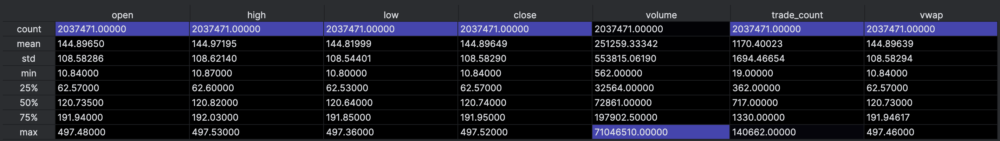
*The tale shows descriptive statistics for varies stock data including count, mean, standard deviation, minimum, 25th percentile, median (50th percentile), 75th percentile, and maximum values for each column in the `stock_data.parquet`.*

#### **Plots**

*The plot shows the stock price performance of varies stocks over the specified time period. The x-axis represents the date, while the y-axis represents the stock price in USD.*

### **News Data**

#### **Columns**
- `timestamp`: Date and time of the news article
- `headline`: Headline of the news article
- `content`: Full content of the news article
- `summary`: Summary of the news article
- `url`: URL of the news article

#### **Descriptive Statistics**

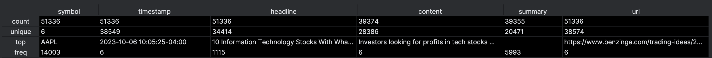
*The dataset `news_data.parquet` has about 51000 news entries. Most headlines are unique, but some are repeated many times, showing duplicated or widely shared stories. Some content and summaries are missing, so the data is uneven. Overall, it’s a mix of unique articles and repeated reports.*

#### **Plots**

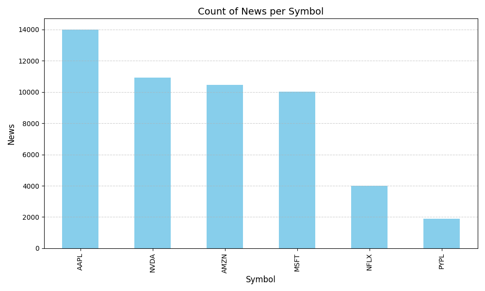

*The plot shows the number of stock news articles for each symbol*

### **Senator Financial Disclosures Data**

#### **Data**

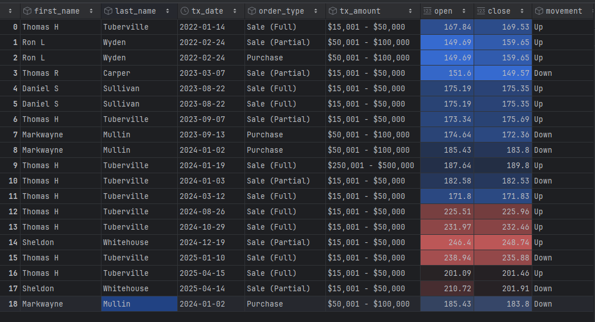

#### **Columns**
- `tx_date` : Date of Trade
- `file_date`: Date of when the trade was filed
- `last_name`: Last Name of Senator
- `first_name`: First Name of Senator
- `order_type`: Sale or Purchase of stock
- `ticker`: ticker of the stock traded
- `asset_name`: name of the company of the stock traded
- `tx_amount`: amount of stock traded
- `link`: Link to the entry

#### **Plots**

*Financial disclosures filed as pure readable periodic disclosures vs filed as non-readable PDF files*

*Number of stock trades by US Senators per year*

*Which senators trade the most per year including PDF filings*

---

## 3 - Pre-Split Preparation

### **Description**

This step involves preparing the stock data, news data and senator trades data for modeling by creating new features and cleaning the data.

### **Script**

[03_data_pre_split.py](scripts/03_data_pre_split.py)
[03_pre_split_preparation_news.py](scripts/03_data_pre_split_news.py) 
[03_data_pre_split_senator_trades.ipynb](scripts/03_data_pre_split_senator_trades.ipynb)

### **Stock Data**
- New features are stored in `stock_features.parquet`
- Normalized VWAP (Volume Weighted Average Price) and Volume
- Exponential Moving Average over t = [5, 10, 15, 30] minutes
- Linear Regression Slope of EMAs over t = [5, 10, 15, 30] minutes
- Second-order Slope (Acceleration) of EMAs over t = [5, 10, 15, 30] minutes

#### *Plots*
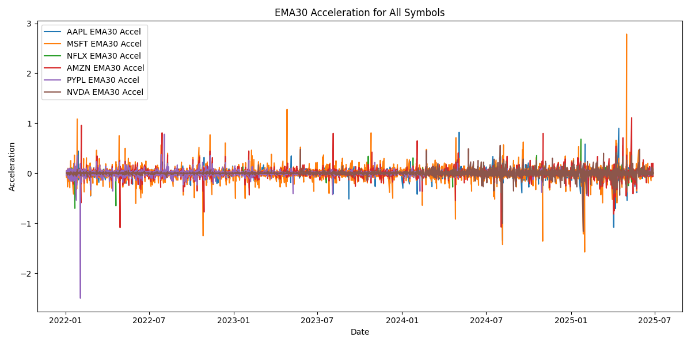
*The plot shows the EMA acceleration over a 30-minute period for each symbol*

### **News Data**
- New features are stored in `news_features.parquet`
- Sentiment Analysis Features using the VADER sentiment analysis model
  - +1 indicates positive sentiment
  - -1 indicates negative sentiment
  - 0 indicates neutral sentiment
- Relevance Category classified as positive, negative, or neutral based on the stock price movement on the day the news was published

#### **Plots**

*The plot shows the sentiment distribution for each symbol. Most stock news articles are neutral, suggesting they have little to no influence on the stock price, and there are more positive articles than negative ones*

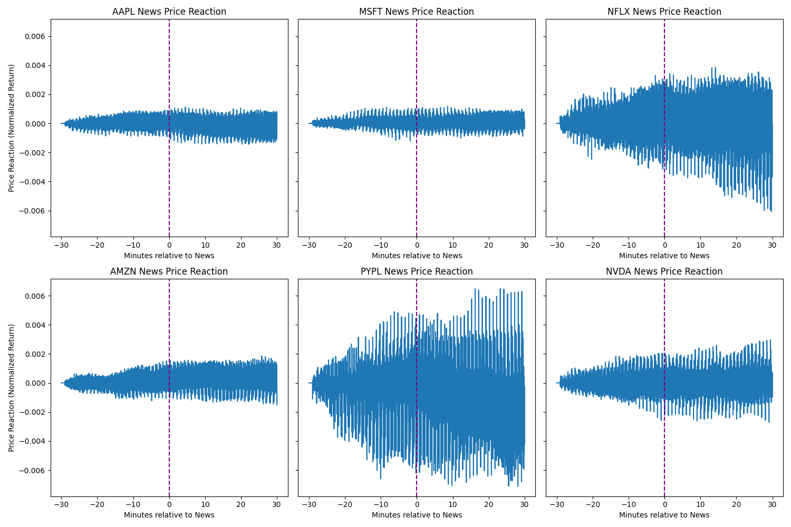
*The plot shows the normalized price reaction of each symbol to stock news articles at their publication time, within a 60-minute window (30 minutes before and 30 minutes after publication). It indicates that PYPL is the most affected by news releases, followed by NFLX, while the other stocks show much weaker reactions*

### **Senator Financial Disclosures Data**
- New features are stored in `senator_features.csv`
- Movement Category classified as up and down based on the stock price movement on the day after the trade was made

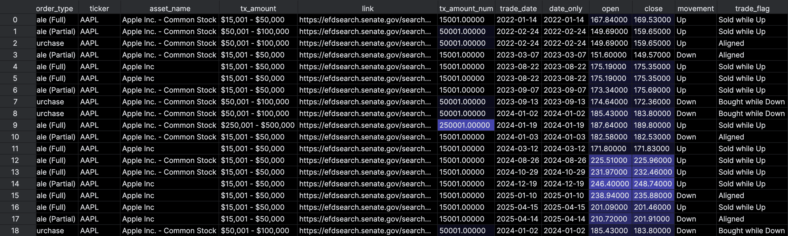

#### **Plots**

*Splits the trade amounts into ranges for better visualization of trading activity. Order type Exchange was excluded because of inproper data.*

---
## 4 - Split Data

### **Description**

This step involves loading stock data and applies chronological train/validation/test splits.

### **Script**

[04_split_data.py](scripts/04_split_data.py)

#### **Plots**

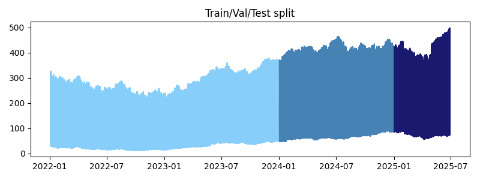
*The plot shows the stock data divided into training, validation, and test splits.*

---

## 5 - Post-Split Preparation

### **Description**

This step involves preparing the merged stock–news dataset for model training by aligning timestamps, applying predefined chronological splits, extracting the relevant features and target variables.

### **Script**

[05_post_split.py](scripts/05_post_split.py)

### **Stock & News Data**
Stock and news features were merged on synchronized using pd.merge_asof with a 5‑minute tolerance. Training, validation, and test splits were defined and stored in `splits.json`.

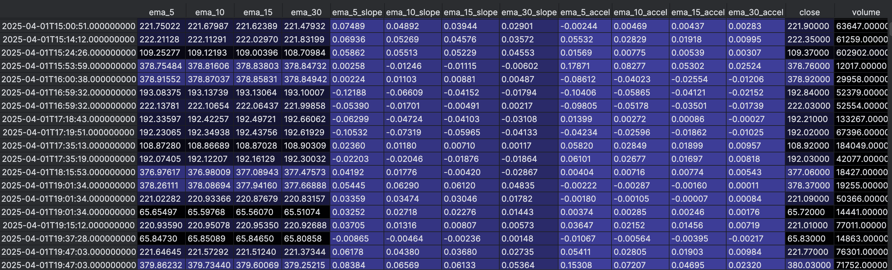

#### **Data Sources**
- `stock_features.parquet`
- `news_features.parquet`

#### **Splits**
- Train: 2022-01-01 to 2024-12-31
- Validation: 2025-01-01 to 2025-03-31
- Test: 2025-04-01 to 2025-06-30

#### **Features**
- ema_5, ema_10, ema_15, ema_30
- ema_w_slope_5, ema_w_slope_10, ema_w_slope_15, ema_w_slope_30
- ema_w_accel_5, ema_w_accel_10, ema_w_accel_15, ema_w_accel_30

#### **Target**
- future_return_30m: Expected return 30 minutes after a news event

---

## 6 - Feature Selection

### **Description**

This step focuses on determining the most significant predictive features by examining their correlation with the target variable. The objective is to identify which engineered stock- and news-derived features exhibit meaningful associations with future returns and should therefore be incorporated into model training.

### **Script**

[06_feature_selection.py](scripts/06_feature_selection.py)

#### *Plots*

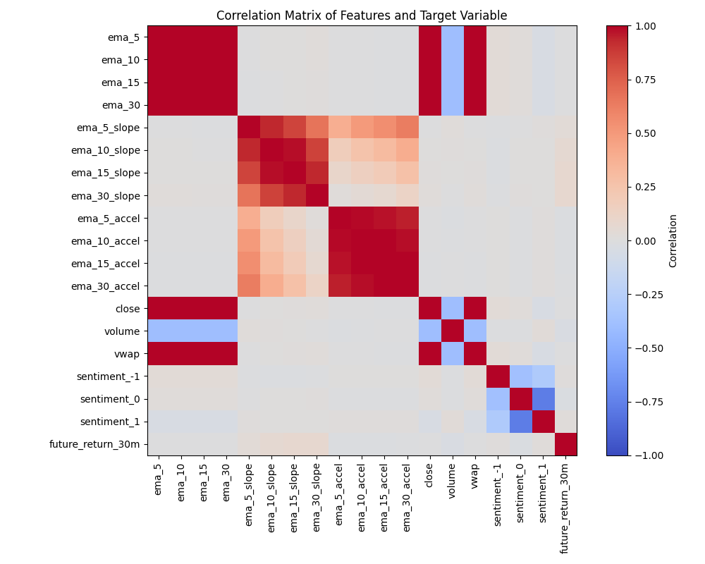
*The plot shows a heatmap of how various engineered financial features relate to each other and to the target variable future_return_30m.The correlation between features and target a generally low to moderate, indicating no feature dominates prediction*

---

## 7 - Model Training & Validation

### **Description**
This step involves training a random forest model to predict short-term returns using financial and news-based features.

### **Script**

[06_data_modeling.ipynb](scripts/06_data_modeling.ipynb)
[07_model_training.py](scripts/07_model_training.py)

### **Stock & News Data**

#### **Architecture**
- Random Forest: Ensemble of decision trees, no neural network layers

#### **Parameters**
- 100 trees, reproducible seed, parallelized training

#### **Baseline**
- R² 

#### **Plots**

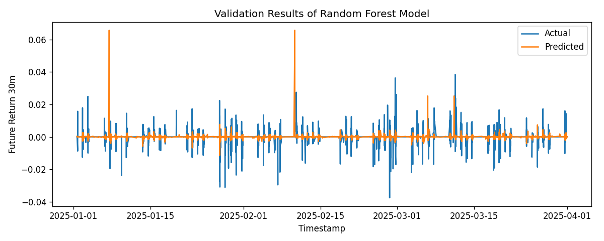
*The plot shows the validation result of the random forest mode for prediction future returns for the next 30 minutes.
When the predicted and actual lines align, the model captures short‑term return dynamics well, while deviations reveal periods of weaker 
performance likely caused by market noise or sudden sentiment shifts. Overall, it offers a visual check of accuracy and stability, indicating that the 
random forest can capture general trends but struggles with fine‑grained fluctuations*

---

## 8 - Final Testing

### **Description**

This step involves evaluating the trained Random Forest model on the test dataset to assess its ability to generalize beyond the training and validation sets. The script loads the previously saved model and applies it to unseen test data.

### **Script**
[08_model_testing.py](scripts/08_model_testing.py)

#### *Plots*
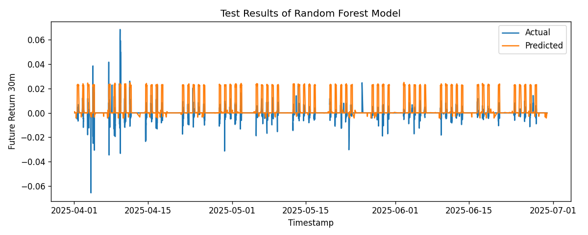
*The plot shows the test results of the random forest model, revealing a large variance between predicted and actual prices. This suggests that the model requires further refinement and improvement*

---

## 9 - Deployment

### **Description**
### **Script**
### **Stock Data**
#### *Plots*

### **News Data**
#### *Plots*

### **Senator Financial Disclosures Data**
#### *Plots*

