# Forecasting Apple Stock Prices

## Problem Definition
**Target**

The goal of this project is to predict the short-term intraday return of selected U.S. stocks (AAPL, MSFT, NFLX, AMZN PYPL, NVDA) over the next 30 minutes using historical minute-level market data, historical financial news and senator trades from 2022-01-01 to 2025-06-30.
The target variable is the future 30‑minute return. We used a random forest regression model  to estimate this return, which is then converted into trading signals (LONG vs. FLAT) for deployment in a live paper‑trading environment.

**Input Features**

Normalized VWAP (volume weighted average price) and volume
Normalized exponential moving average (EMA) over t = [5, 10, 15, 30] minutes
Linear regression slope of EMAs over t = [5, 10, 15, 30] minutes
Second-order slope (acceleration) of EMAs over t = [5, 10, 15, 30] minutes

---

## Table of Contents

- [1 - Data Acquisition](#1---data-acquisition)
- [2 - Data Understanding](#2---data-understanding)
- [3 - Pre-Split Preparation](#3---pre-split-preparation)
- [4 - Split Data](#4---split-data)
- [5 - Post-Split Preparation](#5---post-split-preparation)
- [6 - Feature Selection](#6---feature-selection)
- [7 - Model Training & Validation](#7---model-training--validation)
- [8 - Final Testing](#8---final-testing)
- [9 - Deployment](#9---deployment)
- [10 - Iteration 1](#10---iteration-1)

---

## 1 - Data Acquisition

### **Description**

Retrieves historical stock price data varies stocks using the Alpaca API. The dataset contains minute-level data from **2022-01-01 to 2025-06-30**.
The data request specified the ticker symbol AAPL, MSFT, NFLX, AMZN, PYPL, NVDA and included fields such as timestamp, open, high, low, close, volume, trade_count, and vwap. 
The retrieved data is stored as a Parquet file named `stock_data.parquet` in the `../data/` directory for efficient storage and fast retrieval.

### **Script**

[01_data_acquisition.py](scripts/01_data_acquisition.py)

### **Data**

---

## 2 - Data Understanding

### **Description**

This step involves exploring and understanding varies stock data, news data and senetor trade data obtained from the previous step.

### **Script**

[02_data_understanding.py](scripts/02_data_understanding.py)

### **Stock Data**

#### **Columns**
- `timestamp`: Date and time of the stock price record
- `open`: Opening price of the stock at the given timestamp
- `high`: Highest price of the stock at the given timestamp
- `low`: Lowest price of the stock at the given timestamp
- `close`: Closing price of the stock at the given timestamp
- `volume`: Number of shares traded during the given timestamp
- `trade_count`: Number of trades executed during the given timestamp
- `vwap`: Volume Weighted Average Price during the given timestamp

#### **Descriptive Statistics**

*The tale shows descriptive statistics for varies stock data including count, mean, standard deviation, minimum, 25th percentile, median (50th percentile), 75th percentile, and maximum values for each column in the `stock_data.parquet`.*

#### **Plots**

*The plot shows the stock price performance of varies stocks over the specified time period. The x-axis represents the date, while the y-axis represents the stock price in USD.*

### **News Data**

#### **Columns**
- `timestamp`: Date and time of the news article
- `headline`: Headline of the news article
- `content`: Full content of the news article
- `summary`: Summary of the news article
- `url`: URL of the news article

#### **Descriptive Statistics**

*The dataset `news_data.parquet` has about 51000 news entries. Most headlines are unique, but some are repeated many times, showing duplicated or widely shared stories. Some content and summaries are missing, so the data is uneven. Overall, it’s a mix of unique articles and repeated reports.*

#### **Plots**

*The plot shows the number of stock news articles for each symbol*

### **Senator Financial Disclosures Data**

#### **Data**

#### **Columns**
- `tx_date` : Date of Trade
- `file_date`: Date of when the trade was filed
- `last_name`: Last Name of Senator
- `first_name`: First Name of Senator
- `order_type`: Sale or Purchase of stock
- `ticker`: ticker of the stock traded
- `asset_name`: name of the company of the stock traded
- `tx_amount`: amount of stock traded
- `link`: Link to the entry

#### **Plots**

*Financial disclosures filed as pure readable periodic disclosures vs filed as non-readable PDF files*

*Number of stock trades by US Senators per year*

*Which senators trade the most per year including PDF filings*

---

## 3 - Pre-Split Preparation

### **Description**

This step involves preparing the stock data, news data and senator trades data for modeling by creating new features and cleaning the data.

### **Script**

[03_data_pre_split.py](scripts/03_data_pre_split.py)
[03_pre_split_preparation_news.py](scripts/03_data_pre_split_news.py) 
[03_data_pre_split_senator_trades.ipynb](scripts/03_data_pre_split_senator_trades.ipynb)

### **Stock Data**
- New features are stored in `stock_features.parquet`
- Normalized VWAP (Volume Weighted Average Price) and Volume
- Exponential Moving Average over t = [5, 10, 15, 30] minutes
- Linear Regression Slope of EMAs over t = [5, 10, 15, 30] minutes
- Second-order Slope (Acceleration) of EMAs over t = [5, 10, 15, 30] minutes

#### *Plots*

*The plot shows the EMA acceleration over a 30-minute period for each symbol*

### **News Data**
- New features are stored in `news_features.parquet`
- Sentiment Analysis Features using the VADER sentiment analysis model
  - +1 indicates positive sentiment
  - -1 indicates negative sentiment
  - 0 indicates neutral sentiment
- Relevance Category classified as positive, negative, or neutral based on the stock price movement on the day the news was published

#### **Plots**

*The plot shows the sentiment distribution for each symbol. Most stock news articles are neutral, suggesting they have little to no influence on the stock price, and there are more positive articles than negative ones*

*The plot shows the normalized price reaction of each symbol to stock news articles at their publication time, within a 300-minute window (150 minutes before and 150 minutes after publication). It indicates that PYPL is the most affected by news releases, followed by NFLX, while the other stocks show much weaker reactions*

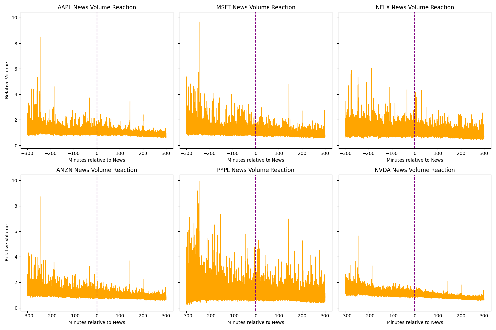
*The plot shows the normalized trading volume reaction of each symbol to stock news articles at their publication time, within a 300‑minute window (150 minutes before and 150 minutes after publication). It indicates that PYPL exhibits the strongest surge in trading activity following news releases, with NFLX also showing a noticeable increase, while the other stocks display comparatively weaker changes in volume.*

### **Senator Financial Disclosures Data**
- New features are stored in `senator_features.csv`
- Movement Category classified as up and down based on the stock price movement on the day after the trade was made
- Data was extendend to include timestamps of publications of financial disclosures.

#### **Plots**

*Splits the trade amounts into ranges for better visualization of trading activity. Order type Exchange was excluded because of inproper data.*

---
## 4 - Split Data

### **Description**

This step involves loading stock data and applies chronological train/validation/test splits.

### **Script**

[04_split_data.py](scripts/04_split_data.py)

#### **Plots**

*The plot shows the stock data divided into training, validation, and test splits.*

---

## 5 - Post-Split Preparation

### **Description**

This step involves preparing the merged stock–news dataset for model training by aligning timestamps, applying predefined chronological splits, extracting the relevant features and target variables. 

### **Script**

[05_post_split.py](scripts/05_post_split.py)

### **Stock & News Data**
Stock and news features were merged on synchronized using pd.merge_asof with a 5‑minute tolerance. Training, validation, and test splits were defined and stored in `splits.json`.

### **Stock & Senator Data**
Senator data was merged and timezones were aligned. Trade ranges (e.g. "$15,001 – $50,000") were converted into a midpoint. 
Negative midpoints signifiy a sale of stock, positive signify a stock purchase. Trade filing times were parsed into full timestamps.

#### **Data Sources**
- `stock_features.parquet`
- `news_features.parquet`
- `merged_senator_transactions_2022_2025.csv`

#### **Splits**
- Train: 2022-01-01 to 2023-12-31
- Validation: 2024-01-01 to 2024-12-31
- Test: 2025-01-01 to 2025-06-30

#### **Features**
- ema_5, ema_10, ema_15, ema_30
- ema_w_slope_5, ema_w_slope_10, ema_w_slope_15, ema_w_slope_30
- ema_w_accel_5, ema_w_accel_10, ema_w_accel_15, ema_w_accel_30
- mean_amount, time_of_filed

#### **Target**
- future_return_30m: Expected return 30 minutes after a news event

---

## 6 - Feature Selection

### **Description**

This step focuses on determining the most significant predictive features by examining their correlation with the target variable. The objective is to identify which engineered stock- and news-derived features exhibit meaningful associations with future returns and should therefore be incorporated into model training.

### **Script**
[06_data_modeling.ipynb](scripts/06_feature_selection.py)
[06_feature_selection.py](scripts/06_feature_selection.py)

#### *Plots*

*The plot shows a heatmap of how various engineered financial features relate to each other and to the target variable future_return_30m.The correlation between features and target a generally low to moderate, indicating no feature dominates prediction*

---

## 7 - Model Training & Validation

### **Description**
This step involves training a random forest model to predict short-term returns using financial and news-based features.

### **Script**

[07_model_training.py](scripts/07_model_training.py)

[07_modell_training_senators.ipynb](scripts/07_modell_training_senators.ipynb)

### **Stock & News Data**

#### **Architecture**
- Random Forest: Ensemble of decision trees, no neural network layers

#### **Parameters**
- Algorithm: Random Forest
- No neural network layers
- Parameters:
  - n_estimators = 300 (number of trees)
  - random_state = 42 (reproducibility)
  - n_jobs = -1 (parallelized training)

#### **Baseline**
- Comparison against a Mean Return Baseline per symbol
- Evaluation metric: Mean Absolute Error (MAE)

#### **Plots**

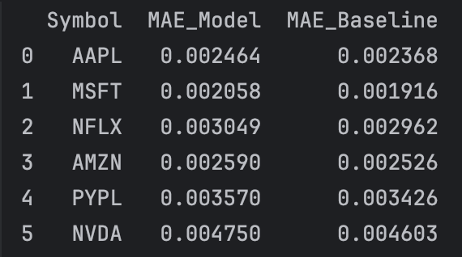
*This table summarizes the prediction accuracy of the random forest model compared to a simple mean-return baseline across six stock symbols.
The comparison highlights that while the model slightly outperforms the baseline in most cases, the margin is narrow—suggesting that short-term return prediction remains challenging due to market noise and volatility.*

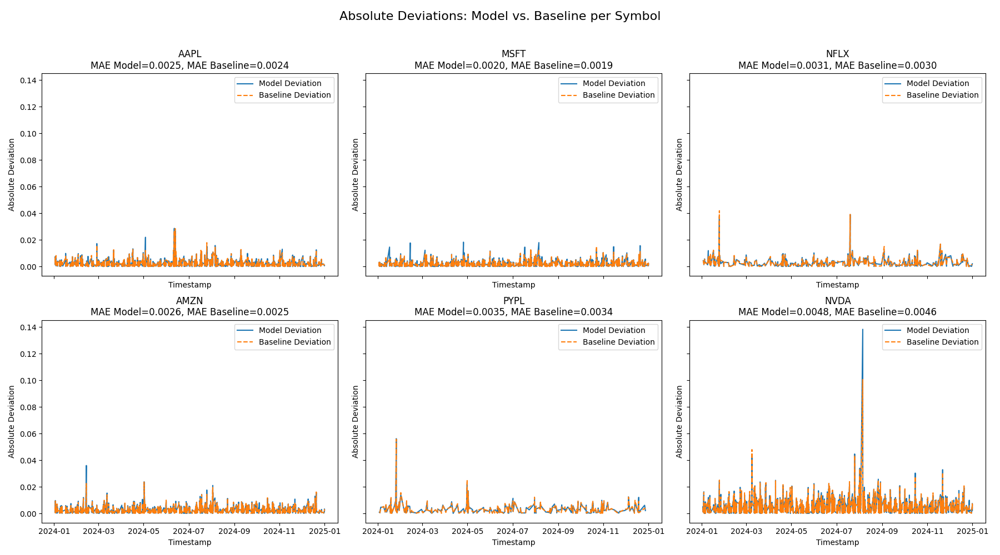
*The plot compares the absolute deviation of the random forest model against a mean-return baseline across six stock symbols. Each subplot shows how prediction errors evolve over time.*

---

## 8 - Final Testing

### **Description**

This step involves evaluating the trained random forest model on the test dataset to assess its ability to generalize beyond the training and validation sets. The script loads the previously saved model and applies it to unseen test data.

### **Script**
[08_model_testing.py](scripts/08_model_testing.py)

#### *Plots*
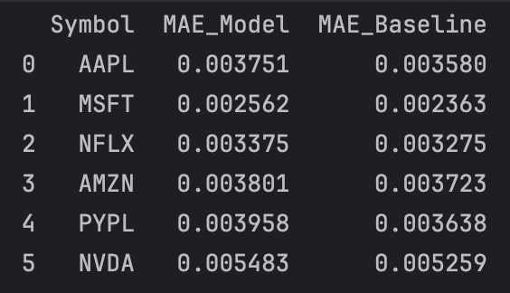
*This table presents the final evaluation of the random forest model on unseen test data. For each stock symbol, it compares the model’s MAE against a simple mean-return baseline. The results show that the model consistently performs slightly worse than the baseline, indicating limited generalization capability and highlighting the need for further refinement or alternative modeling approaches.*

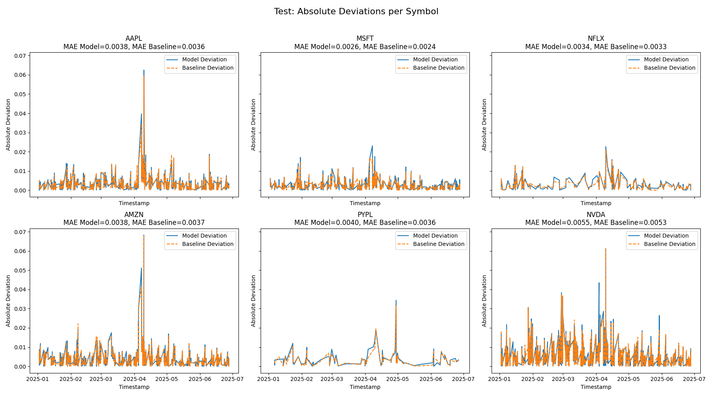
*The plot shows the test results of the random forest model, revealing a large variance between predicted and actual prices. This suggests that the model requires further refinement and improvement*

---

## 9 - Deployment

### **Description**
This step covers the deployment and backtesting of the trained random forest model for stock return prediction. The goal is to evaluate how the trading strategy derived from the model would have performed compared to a simple buy-and-hold approach.

### **Script**
[09_deployment_backtest.py](scripts/09_deployment_backtest.py)
[09_deployment_papertrade.py](scripts/09_deployment_papertrade.py)
[09_model_deployment.ipynb](scripts/09_model_deployment.ipynb)
[09_senator_deployment_papertrades.ipynb](scripts/09_senator_deployment_papertrades.ipynb) 

### **Stock & News Data**

#### *Backtest*
The model predicts the future 30-minute return (`future_return_30m`). From these predictions we derived a simple trading rule:  
- **Long** (buy): If the predicted return > 0
- **Flat** (no position): If the predicted return ≤ 0

- **Entry:** If the model predicts a positive return, a long position is opened
- **Exit:** If the prediction turns negative or zero, the position is closed

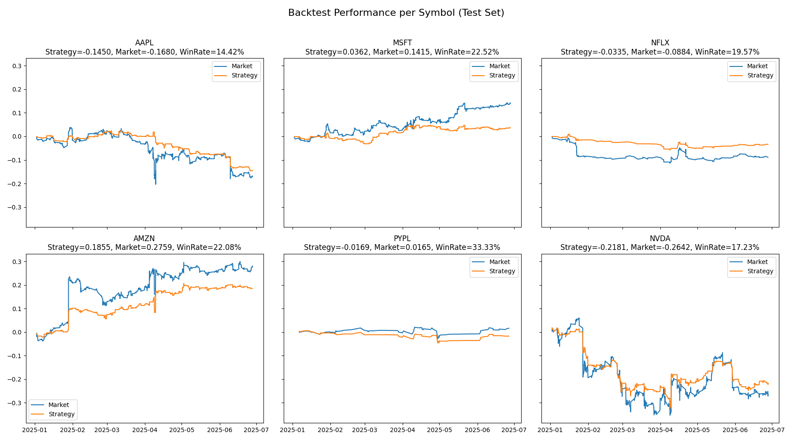
*The market line in the plots represents the buy-and-hold performance. Comparing it to the strategy line shows whether the model added value by avoiding downturns or capturing upswings more effectively.*

#### *Papertrade*
For paper trading we connected the trained model to the Alpaca Paper API. All trades and predictions are stored in `paper_trading_log.csv`. The setup included:
- Live market data: 1‑minute bars per symbol
- Feature engineering: EMAs, slopes, accelerations, close, volume, VWAP
- News sentiment: Headlines fetched via Alpaca News API, analyzed with VADER, mapped into sentiment features (sentiment_-1, sentiment_0, sentiment_1)

Trading rule:
- **Long** (buy): If the predicted return > 0
- **Flat** (no position): If the predicted return ≤ 0

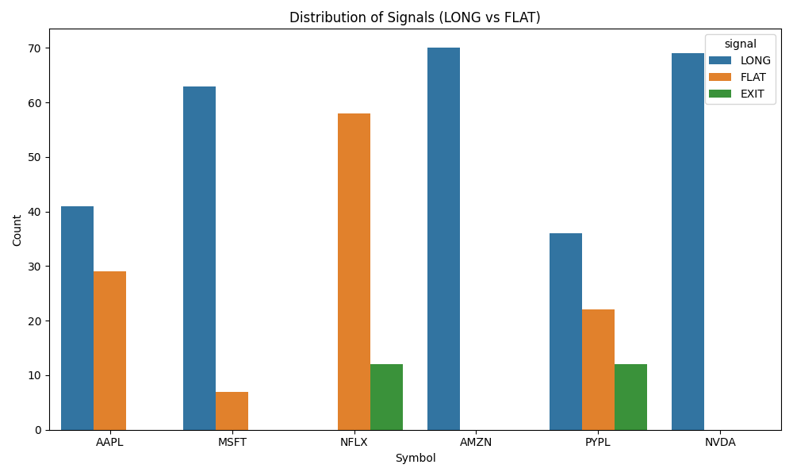

---

Next Steps:
- Change target to a binary classification of up and down movements

### **Stock & Senator Data**

#### *Backtest*
**Test set:** April – June 2025 (unseen data)  
**Target:** `abs_change_pct` – absolute 30-minute price change  

**Trading Rule:**
- Only trade when model predicts unusually strong reactions  
- **Threshold:** top 20 % of predicted absolute moves  
- **Entry:** model predicts `predicted_abs_move > threshold` → open long  
- **Exit:** after 30 minutes (prediction horizon) → close position  

**Baseline:** average absolute 30-minute return (`realized_abs_move.mean()`)

**Performance Analysis:**
- Strategy vs baseline comparison (mean abs return, improvement)
- Per stock performance to see which tickers react stronger
- Equity curve and cumulative returns over time

#### *Papertrade*
For paper trading, the trained model is applied to the same feature set in near real-time. Features include:
- `signed_amount`, `tx_hour`, `tx_weekday`, `price_before`, `vol_before`, `vwap_before`  

Trading rule:
- **Long** (buy): If `predicted_abs_move > threshold`  
- **Flat** (no position): Otherwise  

All trades and predictions are stored in `paper_trading_log.csv`.  

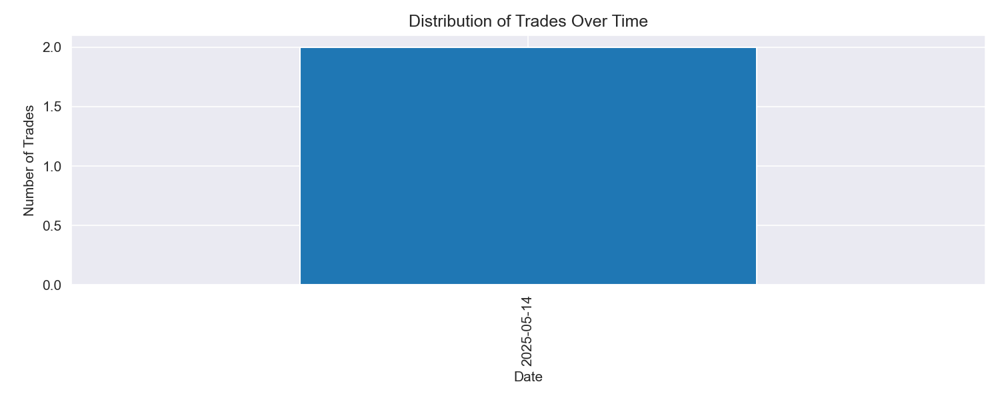
*Distribution of LONG trades over time per ticker.*

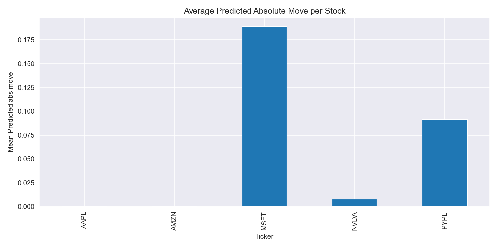
*Average predicted absolute move per stock.*

---
## 10 - Iteration 1

### **Description**

1. Added new target variable `target_direction` for classification of up/down movement and re-trained random forest classifier. Evaluated performance on validation set using accuracy and compared to regression model performance using MAE.

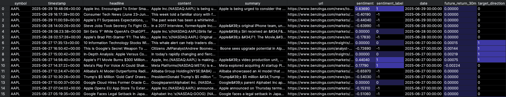

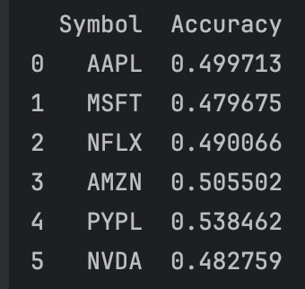
*Random Forest Classifier Accuracy on validation set per symbol.*

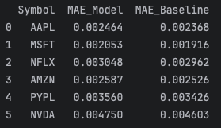
*Random Forest Regressor MAE on validation set per symbol.*

2. Added new feature `volume_spike` to capture sudden increases in trading volume and re-trained random forest regressor. 

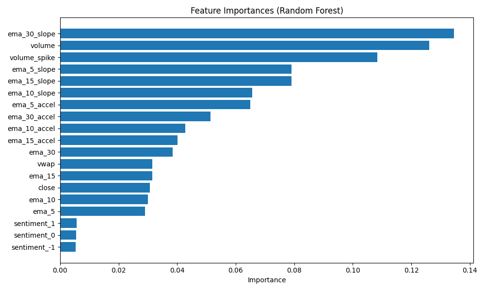

3. Implemented EXIT signal based on predicted return turning negative for a more realistic trading strategy during paper trading.

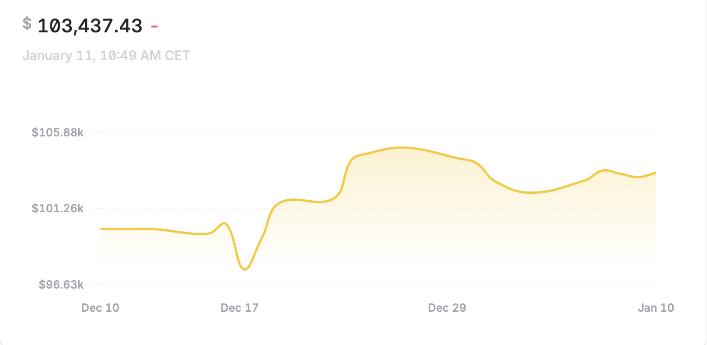
*Overall performance of the news-based model during paper trading*
---

### **Description**

This iteration focuses on improving the **senator-based trading deployment** and enabling **systematic strategy comparison**.

---

### **Multi-Account Paper Trading**

The senator model was deployed simultaneously on **three separate Alpaca paper trading accounts**, each using the same model but a different **decision threshold (`conf_threshold`)** to reflect different risk profiles:

- **Baseline:** `conf_threshold = 0.01` (backtested default)  
- **Conservative:** `conf_threshold = 0.02` (only reacts on strong signals, therefore trades less frequent)  
- **Aggressive:** `conf_threshold = 0.005` (more frequent trades due to accepting weaker signals)  

This setup allows direct comparison of **trade frequency** and **equity development** under identical market conditions.

---

### **Deployment & Logging**

- The system runs continuously on an **AWS EC2 instance** during market hours. 
- The EC2 is made of a t3.mirco with 2 virtual CPUs and 1 Gb of memory, enough to run the traines randomforest model on.
- All predictions and trade decisions are logged to `paper_trading_log.csv`, including:  
  `timestamp`, `account`, `symbol`, `signal`, `prediction`, and `equity`.
- Using split the models to run on the local network aswell as AWS for redundancy.

---

### **Status & Limitations**

- Live evaluation is still limited due to **short runtime**.  
- EC2 instance is running script on sheduled time to limit needed resources. 
- Issues with testing running the script on the servers due to limited market hours on weekdays and weekends.
---

