# Forecasting Apple Stock Prices

## Problem Definition
**Target**

The goal of this project is to predict the intraday trend direction of Apple Inc. (AAPL) stock prices over the next t = [5, 10, 15, 30, 60] minutes using historical minute-level data from 2022-01-01 to 2025-06-30. 
We use a Random Forest model with features including the linear regression slope over each t-minute window, normalized by the mean price, to classify the trend direction.

**Input Features**

Normalized VWAP (volume weighted average price) and volume
Normalized exponential moving average (EMA) over t = [5, 10, 15, 30, 60] minutes
Linear regression slope of EMAs over t = [5, 10, 15, 30, 60] minutes
Second-order slope (acceleration) of EMAs over t = [5, 10, 15, 30, 60] minutes

---

## Table of Contents

- [1 - Data Acquisition](#1-data-acquisition)
- [2 - Data Understanding](#2-data-understanding)
- [3 - Pre-Split Preparation](#3-pre-split-preparation)

---

## 1 - Data Acquisition

**Description**

Retrieves historical stock price data for Apple Inc. (AAPL) using the Alpaca API. The dataset contains minute-level data from **2022-01-01 to 2025-06-30**.
The data request specified the ticker symbol AAPL and included fields such as timestamp, open, high, low, close, volume, trade_count, and vwap. 
The retrieved data is stored as a Parquet file named `AAPL.parquet` in the `../data/` directory for efficient storage and fast retrieval.

**Script**

[01_data_acquisition.py](scripts/01_data_acquisition.py)

**Data**

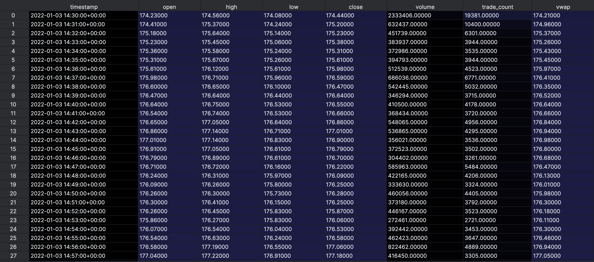

---

## 2 - Data Understanding

**Description**

This step involves exploring and understanding the AAPL stock data and news data obtained from the previous step.

**Script**

[02_data_understanding.py](scripts/02_data_understanding.py)
[02_data_understanding_news.py](scripts/02_data_understanding.py)

**AAPL Stock Data**

**- Columns**
- `timestamp`: Date and time of the stock price record
- `open`: Opening price of the stock at the given timestamp
- `high`: Highest price of the stock at the given timestamp
- `low`: Lowest price of the stock at the given timestamp
- `close`: Closing price of the stock at the given timestamp
- `volume`: Number of shares traded during the given timestamp
- `trade_count`: Number of trades executed during the given timestamp
- `vwap`: Volume Weighted Average Price during the given timestamp

**- Descriptive Statistics**

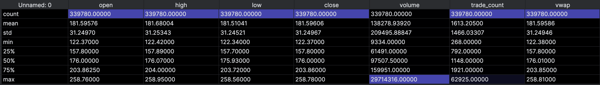
*The table provides descriptive statistics for the AAPL stock data, including count, mean, standard deviation, minimum, 25th percentile, median (50th percentile), 75th percentile, and maximum values for each column in the `AAPL.parquet`.
The stock showed significant volatility, trading between 122–259 USD. Trading activity was highly uneven, likely driven by major news events or market announcements.*

**News Data**

**- Columns**
- `timestamp`: Date and time of the news article
- `headline`: Headline of the news article
- `content`: Full content of the news article
- `summary`: Summary of the news article
- `url`: URL of the news article

**- Descriptive Statistics**

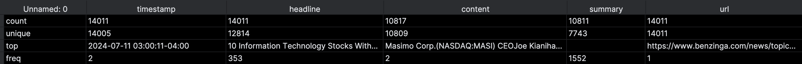
*The dataset `APPL_news.csv` has about 14000 news entries. Most headlines are unique, but some are repeated many times, showing duplicated or widely shared stories. Some content and summaries are missing, so the data is uneven. Overall, it’s a mix of unique articles and repeated reports.*

**Senator Financial Disclosures Data**

**- Columns**
- `tx_date` : Date of Trade
- `file_date`: Date of when the trade was filed
- `last_name`: Last Name of Senator
- `first_name`: First Name of Senator
- `order_type`: Sale or Purchase of stock
- `ticker`: ticker of the stock traded
- `asset_name`: name of the company of the stock traded (AAPL stock = Apple company)
- `tx_amount`: amount of stock traded
- `link`: Link to the entry

**Plots**

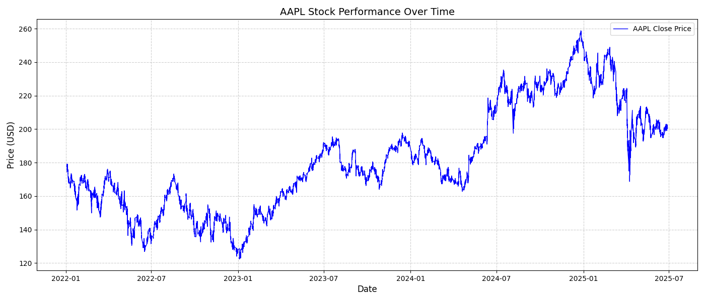
*The plot shows the stock price performance of AAPL over the specified time period. The x-axis represents the date, while the y-axis represents the stock price in USD.*

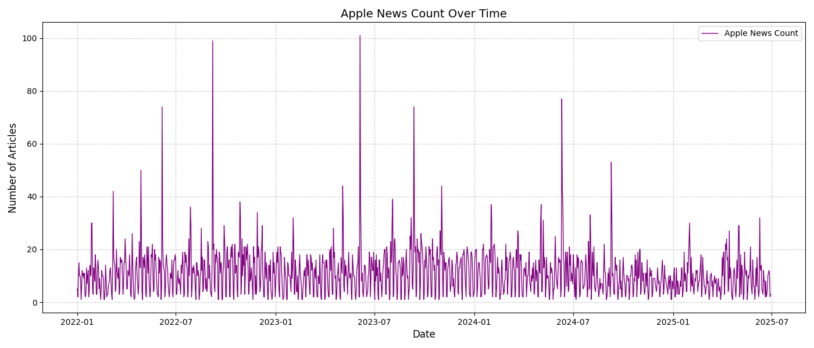
*The plot shows the count of news articles related to AAPL over the specified time period. The x-axis represents the date, while the y-axis represents the number of news articles.*

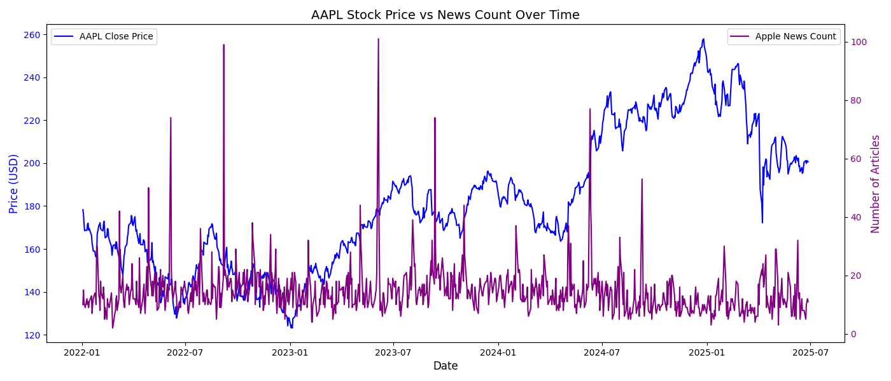
*The plot shows the relationship between AAPL stock prices and the count of news articles over the specified time period. The x-axis represents the date, while the left y-axis represents the stock price in USD and the right y-axis represents the number of news articles.*

*The plot shows the relationship between AAPL’s Volume Weighted Average Price (VWAP) and its closing prices for a random date. The x-axis shows the date, while the y-axis represents the price in USD. When the closing price is above the VWAP, it typically signals bullish market sentiment; conversely, when it falls below, it may indicate bearish tendencies.*

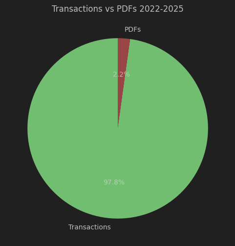
*Financial disclosures filed as pure readable periodic disclosures vs filed as non-readable PDF files*

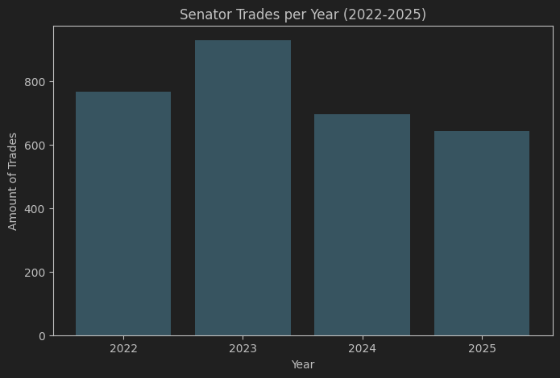
*Number of stock trades by US Senators per year*

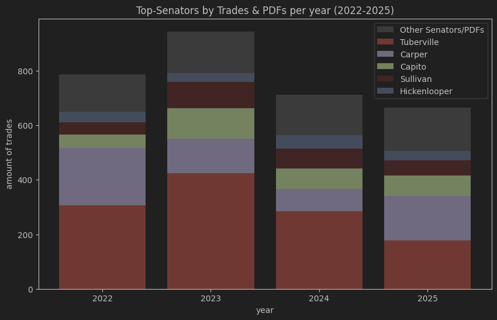
*Which senators trade the most per year including PDF filings*

---

## 3 - Pre-Split Preparation

**Description**
This step involves preparing the AAPL stock data and news data for modeling by creating new features and cleaning the data.

**Script**

[03_pre_split_preparation.py](scripts/03_pre_split_preparation.py)
[03_pre_split_preparation_news.py](scripts/03_pre_split_preparation_news.py)

**AAPL Stock Data**
- New features are stored in `AAPL_features.parquet`
- Normalized VWAP (Volume Weighted Average Price) and Volume
- Exponential Moving Average over t = [5, 10, 15, 30, 60] minutes
- Linear Regression Slope of EMAs over t = [5, 10, 15, 30, 60] minutes
- Second-order Slope (Acceleration) of EMAs over t = [5, 10, 15, 30, 60] minutes

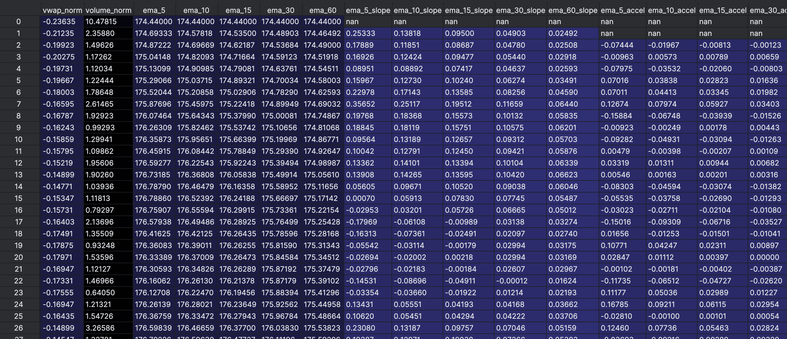

**News Data**
- New features are stored in `news_features.csv`
- Sentiment Analysis Features using the VADER sentiment analysis model
  - +1 indicates positive sentiment
  - -1 indicates negative sentiment
  - 0 indicates neutral sentiment
- Relevance Category classified as positive, negative, or neutral based on the stock price movement on the day the news was published

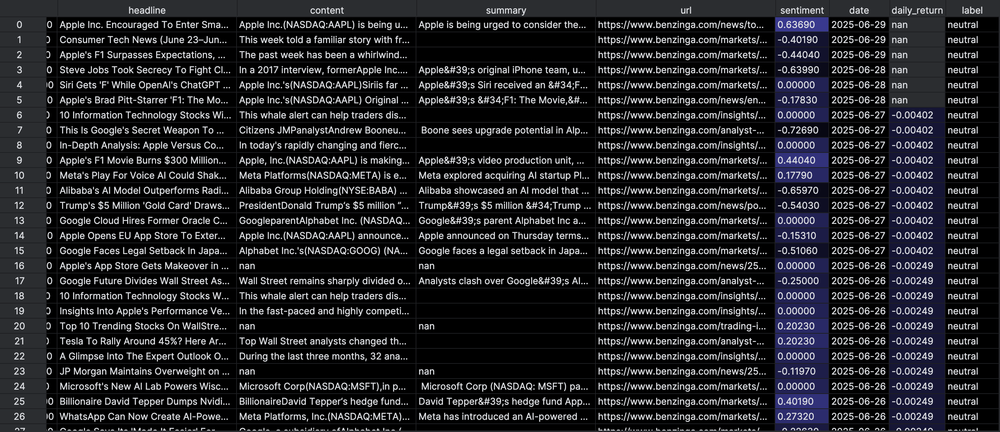

**Senator Financial Disclosures Data**

**Plots**

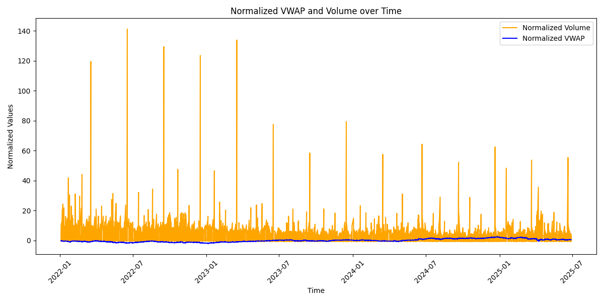
*Normalized VWAP and Volume for AAPL stock over a random date. Both features are scaled between 0 and 1 for better comparison.*

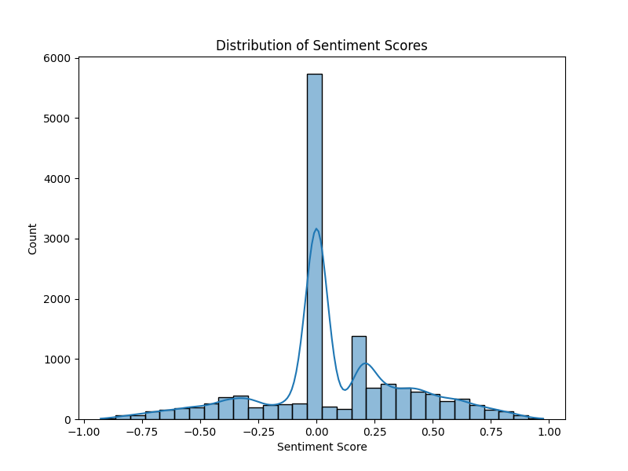
*Distribution of sentiment scores from news articles related to AAPL. The sentiment scores range from -1 (most negative) to +1 (most positive), with a significant number of articles exhibiting neutral sentiment around 0.*

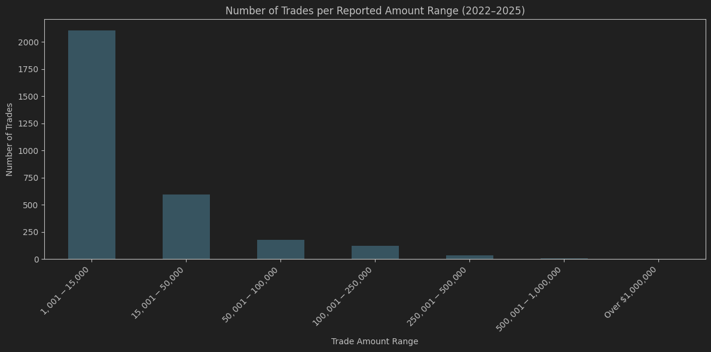
*Splits the trade amounts into ranges for better visualization of trading activity. Order type Exchange was excluded because of inproper data.*

---
## 4 - Split Data
## 5 - Post-Split Preparation
## 6 - Feature Selection
## 7 - Model Training & Validation
## 8 - Final Testing
## 9 - Deployment

